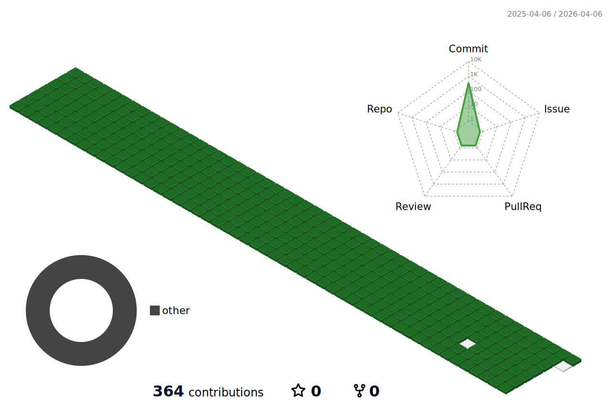

## 💬 ABOUT 關於
Hi, my name is 墨兒. This GitHub account is for doujin activities, including personal website for doujin works. If you are interesting for me or my doujin works, please go to my [PERSONAL WEBSITE](https://star22fall22.github.io/LightInk-Derivative/).

嗨，我是墨兒。這個GitHub帳號是作為同人活動而使用，包含展示同人作品用的個人網站。如果你對我或是我的同人作品有興趣，請前往我的[個人網站](https://star22fall22.github.io/LightInk-Derivative/)。

## 📫 CONTACT 聯絡我
- Plurk噗浪: https://www.plurk.com/star_fall22

- E-mail電子信箱: star22fall22@gmail.com

## 🌱 CONTRIBUTIONS 耕耘過程

<!--
**star22fall22/star22fall22** is a ✨ _special_ ✨ repository because its `README.md` (this file) appears on your GitHub profile.

Here are some ideas to get you started:

- 🔭 I’m currently working on ...
- 🌱 I’m currently learning ...
- 👯 I’m looking to collaborate on ...
- 🤔 I’m looking for help with ...
- 💬 Ask me about ...
- 📫 How to reach me: ...
- 😄 Pronouns: ...
- ⚡ Fun fact: ...
-->

